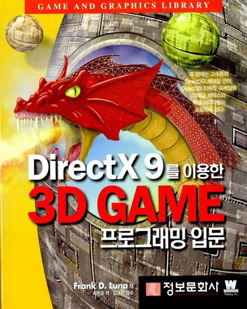

# DirectX 9를 이용한 3D GAME 프로그래밍 입문

## 개요

이 저장소는 Frank D. Luna 저 **"Introduction to 3D Game Programming with DirectX 9.0"** (한국어판: DirectX 9를 이용한 3D GAME 프로그래밍 입문)의 예제 소스 코드를 포함합니다.

- **저자**: Frank D. Luna
- **번역**: 최현호 역, 김성원 감수
- **출판사**: 정보문화사
- **예제 코드 출처**: https://www.d3dcoder.net/default.htm

## 구조

### Book Part II Code (기초)

| 챕터 | 예제 |
|------|------|
| Chapter 1 | D3D9 Init — Direct3D 초기화 |
| Chapter 2 | (예제 없음) |
| Chapter 3 | Triangle, Cube, Teapot, D3DXCreate — 기본 도형 |
| Chapter 4 | Colored Triangle — 색상 삼각형 |
| Chapter 5 | Directional Light, Point Light, Spotlight, Lit Pyramid — 조명 |
| Chapter 6 | AddressModes, TexQuad, TexCube — 텍스처링 |
| Chapter 7 | MtrlAlpha, TexAlpha — 알파 블렌딩 |
| Chapter 8 | Stencil Mirror, Stencil Shadow, Stencil Mirror Shadow — 스텐실 버퍼 |

### Book Part III Code (심화)

| 챕터 | 예제 |
|------|------|
| Chapter 9 | CFont, ID3DXFont, D3DXCreateText — 폰트 렌더링 |
| Chapter 10 | D3DXCreateMeshFVF — 메시 생성 |
| Chapter 11 | XFile, Bounding Volumes, Progressive Mesh — X파일 및 메시 처리 |
| Chapter 12 | Camera — 카메라 구현 |
| Chapter 13 | Terrain, Terrain2 — 지형 렌더링 |
| Chapter 14 | Snow System, Firework System, Laser System — 파티클 시스템 |
| Chapter 15 | Pick — 피킹(오브젝트 선택) |

## 개발 환경

- DirectX 9.0 SDK
- Microsoft Visual C++
- Windows

## 라이선스

예제 코드의 저작권은 원저자 Frank D. Luna에게 있습니다.
원본 코드는 https://www.d3dcoder.net/default.htm 에서 제공됩니다.
